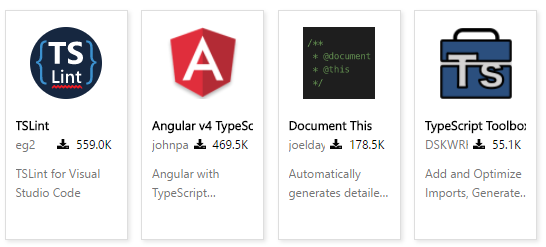

### TypeScript入门

### ts 
> 微软Micros开发  
> js的超集  
> 遵循es6  
> Angular的开发语言  

### ts优势
1. 支持[ES6](http://es6.ruanyifeng.com/)
2. 支持类型检查
3. 实现了注解、泛型等特性

### ts compiler onlie
> [TypeScript官网->Playground](http://www.typescriptlang.org/play/index.html)

### ts compiler local
1. npm install typescript -g
2. 手动编译
    * tsc xx.ts (eg: hello.ts -> hello.js)
3. 自动编译
    * webstorm
        1. Configure->TypeScript->Enable->Apply/OK
    * vscode
        1. F1/Ctrl+Shift+P -> configure task -> 生成tasks.json
        2. tsc --init -> 生成tsconfig.json
        3. edit tsconfig.json -> 法一: Ctrl+Shift+B -> 构建&监视
        4. [edit tasks.json](https://code.visualstudio.com/docs/editor/tasks) -> 法二: Ctrl+Shift+B -> 直接构建
        5. 调试 -> Ctrl+Shift+D -> 单击调试视图顶部栏上的配置齿轮图标 -> node.js
        6. [edit launch.json](https://code.visualstudio.com/docs/editor/debugging)
    > 参考
    > https://segmentfault.com/a/1190000011935122
    > https://blog.csdn.net/tiantangyouzui/article/details/52163175
    > https://www.jianshu.com/p/8402469f1cae

### ts vscode 插件

### IMOOC-React
https://www.imooc.com/learn/763

> vscode Ctrl+Shift+V 预览MD
